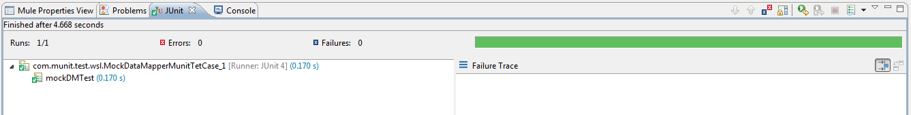

[Purpose](#purpose)  
[Test the application](#test-the-application)  

Purpose
===========

This document illustrates the concept of **Mocking Data-Mapper** with a basic usecase. Mocking is achieved using MUnit Framework.
Use-case: Transform payload to xml using Data-Mapper(mock).

Adding 'mappings' folder to Source Path
=================

Steps follows with the explaination on how to add **mappings** folder

### Step 1: Add Datamapper to Source Path
1. Right click on mappings folder.
2. Hover on 'Build Path' 
3. Select 'Use as Source Folder' option.

Test the application
=======================

1. Navigate to src/test/java folder
2. Right click on MockDataMapperMunitTetCase_1.java and select **Run As JUnit Test**.
3. Switchover to JUnit wundow to see the output.

